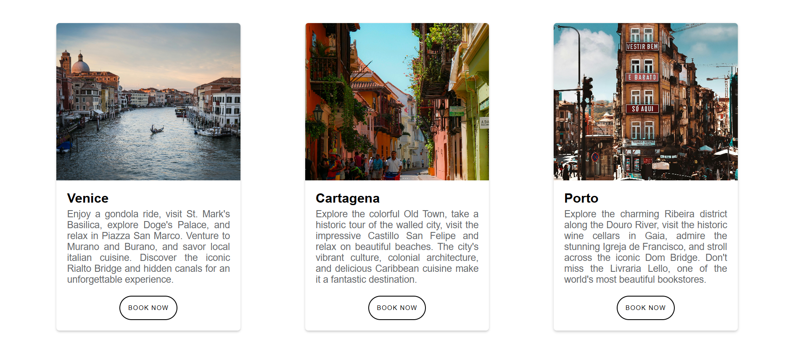
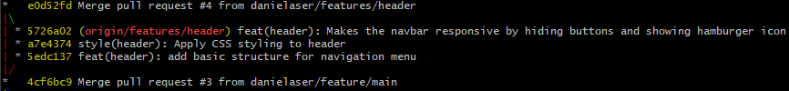
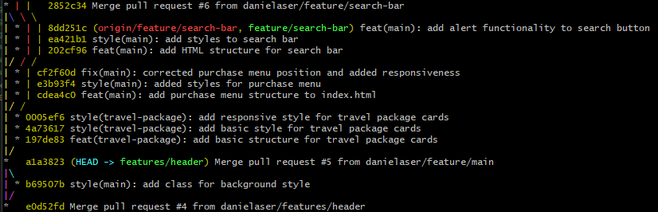
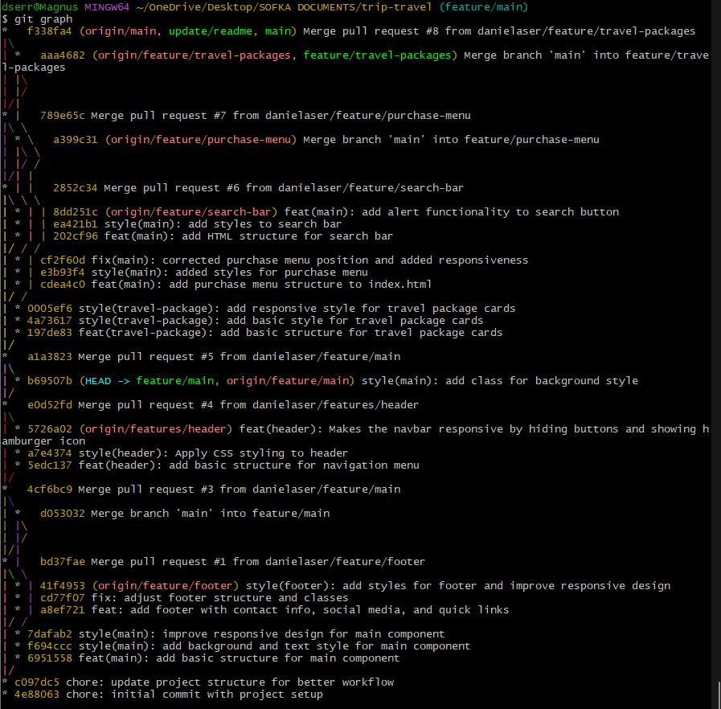
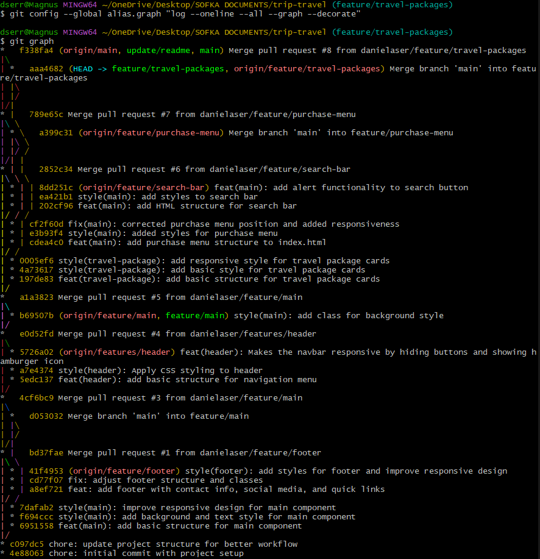
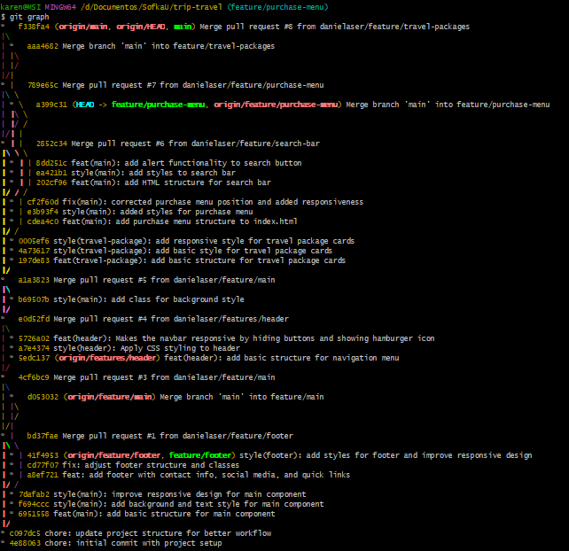
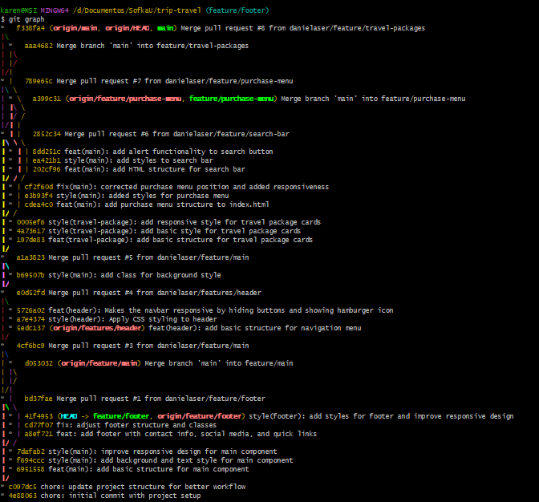

# Trip Travel

This is a travel and booking landing page where the user can discover the world from above with our exclusive flight tours, private charters, and aerial adventures, also explore breathtaking destinations and create unforgettable experiences tailored.

## Table of contents

- [Overview](#overview)
  - [Screenshot](#screenshot)
  - [Git](#git)
  - [Links](#links)
- [My process](#my-process)
  - [Built with](#built-with)
- [Author](#author)

## Overview

### Screenshot

### Git

Git Header

Git Search

Git Main

Git Travel Packages

Git Purchase menu

Git Footer

### Links

- Live Site URL: [Trip Travel](https://)

## Process

### Built with

- Git
- Vanilla JS
- CSS custom properties
- Responsive css
- HTML5

## Authors

- Karen Rincon
- Hernan Calderon
- Daniela Serrano
